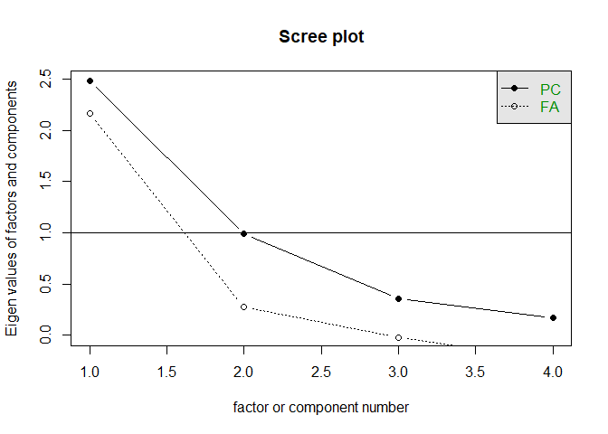
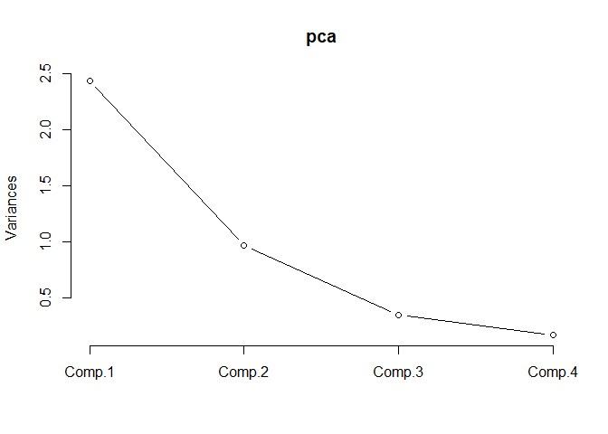
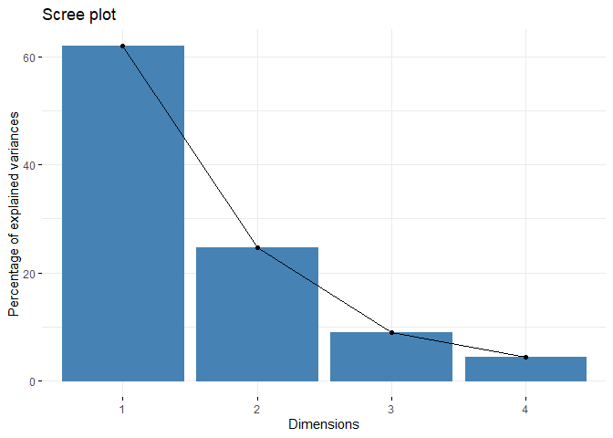

# Analisis Komponen Utama  

``` r
library(factoextra)
library(psych)
```

Lakukan PCA pada data `USArrests`.

## Manual


### Menyiapkan Data


``` r
data("USArrests")
knitr::kable(head(USArrests, 10))
```

|             |  Murder|  Assault|  UrbanPop|  Rape|
|:------------|-------:|--------:|---------:|-----:|
| Alabama     |    13.2|      236|        58|  21.2|
| Alaska      |    10.0|      263|        48|  44.5|
| Arizona     |     8.1|      294|        80|  31.0|
| Arkansas    |     8.8|      190|        50|  19.5|
| California  |     9.0|      276|        91|  40.6|
| Colorado    |     7.9|      204|        78|  38.7|
| Connecticut |     3.3|      110|        77|  11.1|
| Delaware    |     5.9|      238|        72|  15.8|
| Florida     |    15.4|      335|        80|  31.9|
| Georgia     |    17.4|      211|        60|  25.8|

Hal pertama yang baik untuk dilakukan adalah melakukan scaling pada
data. Hal ini dilakukan ketika variabel memiliki maginitude yang
berbeda. Pada dataset diatas terlihat bahwa variabel `Murder` memiliki
besaran yang berbeda dengan `Assult`. Hal ini juga dapat dilihat dari
varians setiap variabelnya yang sangat berbeda jauh

``` r
apply(USArrests, 2, var)
```

    ##     Murder    Assault   UrbanPop       Rape 
    ##   18.97047 6945.16571  209.51878   87.72916

``` r
scale_df <- apply(USArrests, 2, scale)
knitr::kable(head(scale_df, 10))
```

|      Murder|     Assault|    UrbanPop|        Rape|
|-----------:|-----------:|-----------:|-----------:|
|   1.2425641|   0.7828393|  -0.5209066|  -0.0034165|
|   0.5078625|   1.1068225|  -1.2117642|   2.4842029|
|   0.0716334|   1.4788032|   0.9989801|   1.0428784|
|   0.2323494|   0.2308680|  -1.0735927|  -0.1849166|
|   0.2782682|   1.2628144|   1.7589234|   2.0678203|
|   0.0257146|   0.3988593|   0.8608085|   1.8649672|
|  -1.0304190|  -0.7290821|   0.7917228|  -1.0817408|
|  -0.4334739|   0.8068381|   0.4462940|  -0.5799463|
|   1.7476714|   1.9707777|   0.9989801|   1.1389667|
|   2.2068599|   0.4828549|  -0.3827351|   0.4877015|

Hal yang perlu diingat bahwa ada kondisi dimana scaling variabel tidak
diperlukan yaitu ketika setiap variabel memiliki unit yang sama atau
analis berharap dapat menangkap perbedaan varians tersebut pada hasil
analisisnya nanti.

Analisis PCA ini sangat dipengaruhi oleh magnitude dari setiap variabel,
sehingga hasil yang diperoleh akan berbeda ketika variabel dilakukan
scaling atau tidak.

### Cari Nilai dan Vector Eigen


``` r
eig <- eigen(cov(scale_df))
eig.val <- eig$values
eig.vec <- eig$vectors
eig
```

    ## eigen() decomposition
    ## $values
    ## [1] 2.4802416 0.9897652 0.3565632 0.1734301
    ## 
    ## $vectors
    ##            [,1]       [,2]       [,3]        [,4]
    ## [1,] -0.5358995  0.4181809 -0.3412327  0.64922780
    ## [2,] -0.5831836  0.1879856 -0.2681484 -0.74340748
    ## [3,] -0.2781909 -0.8728062 -0.3780158  0.13387773
    ## [4,] -0.5434321 -0.1673186  0.8177779  0.08902432

Eigen Vector akan digunakan untuk membentuk loadings dan eigen values
akan digunakan untuk menghitung kontribusi variance yang disumbangkan
oleh principle component yang dibentuk

### Importance of Component


``` r
stdev <- sqrt(eig.val)
tot.var <- sum(eig.val)
prop.var <- eig.val/tot.var
cum.var <- cumsum(prop.var)
t(data.frame("Standard Deviation" = stdev,
     "Proportion of Variance" = prop.var,
     "Cumulative Proportion" = cum.var))
```

    ##                             [,1]      [,2]      [,3]       [,4]
    ## Standard.Deviation     1.5748783 0.9948694 0.5971291 0.41644938
    ## Proportion.of.Variance 0.6200604 0.2474413 0.0891408 0.04335752
    ## Cumulative.Proportion  0.6200604 0.8675017 0.9566425 1.00000000

Terlihat bahwa principle component (PC) pertama menyumbangkan 62%
keragaman data, PC kedua sebesar 25% keragaman data, PC ketiga sebesar
9% dan PC keempat sebesar 4%. Dengan hanya mengambil dua PC pertama maka
kita sudah mengambil 87% dari keragaman data.

Jadi berapa jumlah PC yang baik untuk diambil? **Kembali terserah
anda**. Jika anda berpegang tegauh bahwa PC yang diambil hanya yang
nulai standard deviationnya lebih dari 1 maka hanya 1 PC yang memenuhi.
Tapi jika saya dalam kondisi seperti ini saya akan tetap mengambil 2 PC
karena jika dilihat jika hanya mengambil 1 maka kita masih kehilangan
38% dari keragaman data dan jika dilihat juga PC kedua nilai standard
deviasinya sangat mendekati 1.

Untuk membantu menentukan jumlah PC juga dapat menggunakan scree plot

``` r
scree(scale_df)
```



### Loadings


``` r
loadings <- data.frame(eig.vec)
rownames(loadings) <- colnames(USArrests)
loadings
```

    ##                  X1         X2         X3          X4
    ## Murder   -0.5358995  0.4181809 -0.3412327  0.64922780
    ## Assault  -0.5831836  0.1879856 -0.2681484 -0.74340748
    ## UrbanPop -0.2781909 -0.8728062 -0.3780158  0.13387773
    ## Rape     -0.5434321 -0.1673186  0.8177779  0.08902432

Nilai loading ini untuk melihat sumbangan keragaman data setiap variabel
ke setiap principle component. Terlihat bahwa principle component
pertama banyak disumbangkan oleh variabel `Murder`, `Assult`, dan `Rape`
sedangkan pada principle component kedua disumbangkan oleh variabel
`UrbanPop`

### Scores


``` r
scores <- as.data.frame(scale_df %*% eig.vec)
scores <- cbind(State = row.names(USArrests), scores)
knitr::kable(head(scores, 10))
```

| State       |          V1|          V2|          V3|          V4|
|:------------|-----------:|-----------:|-----------:|-----------:|
| Alabama     |  -0.9756604|   1.1220012|  -0.4398037|   0.1546966|
| Alaska      |  -1.9305379|   1.0624269|   2.0195003|  -0.4341755|
| Arizona     |  -1.7454429|  -0.7384595|   0.0542302|  -0.8262642|
| Arkansas    |   0.1399989|   1.1085423|   0.1134222|  -0.1809736|
| California  |  -2.4986128|  -1.5274267|   0.5925410|  -0.3385592|
| Colorado    |  -1.4993407|  -0.9776297|   1.0840016|   0.0014502|
| Connecticut |   1.3449924|  -1.0779836|  -0.6367925|  -0.1172787|
| Delaware    |  -0.0472298|  -0.3220889|  -0.7114103|  -0.8731133|
| Florida     |  -2.9827597|   0.0388342|  -0.5710321|  -0.0953170|
| Georgia     |  -1.6228074|   1.2660884|  -0.3390182|   1.0659745|

Nilai scores inilah yang akan digunakan untuk analisis lebih lanjut.
Jika dilihat korelasi antara nilai score tiap principle component sudah
sangat kecil, sangat mendekati nol. Sehingga teknik ini cocok digunakan
untuk menghilangkan efek multikolinritas sebelum melakukan analisis
regresi

``` r
cor(scores[-1])
```

    ##               V1            V2            V3            V4
    ## V1  1.000000e+00  9.270460e-16 -1.029060e-16  5.691708e-17
    ## V2  9.270460e-16  1.000000e+00 -5.005977e-16 -5.200715e-16
    ## V3 -1.029060e-16 -5.005977e-16  1.000000e+00  1.066406e-15
    ## V4  5.691708e-17 -5.200715e-16  1.066406e-15  1.000000e+00

## Fungsi Bawaan R


Interpertasi sama dengan analisis yang diatas. Disini akan digunakan
fungsi `princomp` bawaan R

### Membuat Principle Component


``` r
pca <- princomp(scale_df)
summary(pca, loadings = FALSE)
```

    ## Importance of components:
    ##                           Comp.1    Comp.2    Comp.3     Comp.4
    ## Standard deviation     1.5590500 0.9848705 0.5911277 0.41226385
    ## Proportion of Variance 0.6200604 0.2474413 0.0891408 0.04335752
    ## Cumulative Proportion  0.6200604 0.8675017 0.9566425 1.00000000

### Screeplot


``` r
screeplot(pca, type="line")
```



``` r
fviz_eig(pca)
```



### Loadings


``` r
pca$loadings
```

    ## 
    ## Loadings:
    ##          Comp.1 Comp.2 Comp.3 Comp.4
    ## Murder    0.536  0.418  0.341  0.649
    ## Assault   0.583  0.188  0.268 -0.743
    ## UrbanPop  0.278 -0.873  0.378  0.134
    ## Rape      0.543 -0.167 -0.818       
    ## 
    ##                Comp.1 Comp.2 Comp.3 Comp.4
    ## SS loadings      1.00   1.00   1.00   1.00
    ## Proportion Var   0.25   0.25   0.25   0.25
    ## Cumulative Var   0.25   0.50   0.75   1.00

### Scores


``` r
knitr::kable(head(pca$scores, 10))
```

|      Comp.1|      Comp.2|      Comp.3|      Comp.4|
|-----------:|-----------:|-----------:|-----------:|
|   0.9756604|   1.1220012|   0.4398037|   0.1546966|
|   1.9305379|   1.0624269|  -2.0195003|  -0.4341755|
|   1.7454429|  -0.7384595|  -0.0542302|  -0.8262642|
|  -0.1399989|   1.1085423|  -0.1134222|  -0.1809736|
|   2.4986128|  -1.5274267|  -0.5925410|  -0.3385592|
|   1.4993407|  -0.9776297|  -1.0840016|   0.0014502|
|  -1.3449924|  -1.0779836|   0.6367925|  -0.1172787|
|   0.0472298|  -0.3220889|   0.7114103|  -0.8731133|
|   2.9827597|   0.0388342|   0.5710321|  -0.0953170|
|   1.6228074|   1.2660884|   0.3390182|   1.0659745|


