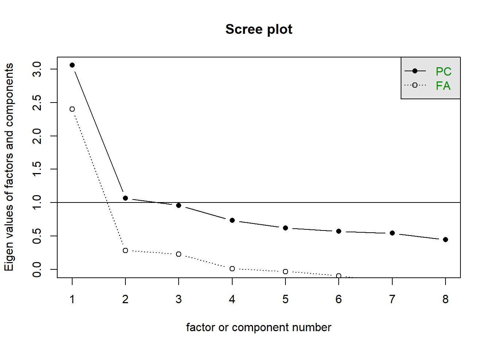

# Analisis Faktor

### Contoh 1

Misal disini akan melakukan analisis faktor untuk data berikut [disini](./data_survery_pjj.csv)

|X1 |X2 |X3 |X4 |X5 |X6 |
|---|---|---|---|---|---|
|4  |5  |4  |3  |4  |5  |
|3  |3  |4  |3  |3  |3  |
|4  |3  |4  |4  |3  |4  |
|2  |5  |5  |4  |5  |5  |
|3  |5  |5  |4  |2  |3  |

Data berupa skala likert 1-5 dengan variabelnya sebagai berikut

1.	Saya tidak memiliki kendala dalam mengakses internet.
2.	Saya terbiasa mencari informasi dari internet.
3.	Saya sudah tahu mengenai Google Classroom sebelumnya sehingga bermanfaat saat pelaksanaan PJJ.
4.	Saya memiliki pengetahuan tentang Zoom, Google Meet ataupun layanan yang sejenis sebelumnya sehingga bermanfaat saat PJJ
5.	Saya tidak masalah seandainya PJJ ini dilanjutkan.
6.	Saya tidak masalah untuk tetap menggunakan Google Classroom untuk pelaksanaan PJJ.


Misal terdapat case bahwa data kurang, dan dibutuhkan resampling dapat melakukan hal berikut

```r
set.seed(1)
indeks_sampel <- sample(1:100, size=300, replace=TRUE)
resample <- data[indeks_sampel,]
```

Maksudnya, dari data awal tersebut diambil data secara acak sebanyak 300 record dengan menggunakan indeksnya.


Kemudian data tersebut, distandarisasi dengan menggunakan fungsi `scale`
```r
strandarized_data = data.frame(scale(resample))
```

kemudian, hal yang pertama dilakukan yaitu uji kenormalan multivariate. Uji kenormalan multivariate dilakukan dengan menggunakan library `MVN` dan fungsi  `mvn`. Hasil dari pengujian nya dapat dilihat sebagai berikut:
```r
library(MVN)
result = mvn(strandarized_data)
```

```
$multivariateNormality
             Test        Statistic              p value Result
1 Mardia Skewness 613.802606757308 7.34997351207197e-95     NO
2 Mardia Kurtosis 7.24881038020658 4.20552481728009e-13     NO
3             MVN             <NA>                 <NA>     NO


$univariateNormality
          Test  Variable Statistic   p value Normality
1 Shapiro-Wilk    X1        0.9016  <0.001      NO    
2 Shapiro-Wilk    X2        0.8287  <0.001      NO    
3 Shapiro-Wilk    X3        0.8352  <0.001      NO    
4 Shapiro-Wilk    X4        0.8486  <0.001      NO    
5 Shapiro-Wilk    X5        0.9073  <0.001      NO    
6 Shapiro-Wilk    X6        0.8800  <0.001      NO    

$Descriptives
     n          Mean Std.Dev      Median       Min      Max        25th
X1 300  1.020957e-16       1 -0.24347279 -1.962104 1.475159 -1.10278854
X2 300 -2.104617e-17       1  0.04641465 -2.485294 1.312269  0.04641465
X3 300 -2.130342e-16       1  0.06549667 -3.864303 1.375430  0.06549667
X4 300  2.280673e-16       1 -0.33215026 -2.704652 2.040352 -0.33215026
X5 300  1.575425e-16       1 -0.16817329 -2.186253 1.849906 -0.16817329
X6 300  1.469445e-16       1  0.32580518 -2.793606 1.365609 -0.71399858
         75th       Skew   Kurtosis
X1 0.61584295 -0.3468872 -0.7791151
X2 0.04641465 -0.5845785  0.1223693
X3 0.06549667 -0.5006858  0.3273621
X4 0.85410067 -0.2285180 -0.8600612
X5 0.84086644 -0.1308939 -0.4626018
X6 0.32580518 -0.4227748 -0.4796645
```

Hasil yang diperoleh adalah kenormalan multivariate, kenormalan univariate, dan deskriptif nya. Kemudian diperoleh Nilai `p−value<0.5` baik untuk yang univariate maupun yang multivariate, sehingga keputusannya adalah Tolak H0 artinya data tidak berdistribusi normal. Namun, pada kasus ini, data diasumsikan berdistribusi normal 😅.

Kemudian lakukan uji ` Sphericity Bartlett` menggunakan package `REdas` untuk menguji apakah terdapat korelasi yang signifikan antar variable penelitian. Uji Bartlett’s Sphericity digunakan untuk menguji apakah terdapat korelasi yang signifikan antar variable penelitian. Secara teknis, Uji Bartlett’s Sphericity menguji apakah matriks korelasi adalah matriks identitas atau bukan. P-value harus signifikan: yaitu, tolak hipotesis nol bahwa semua korelasi diluar diagonal utama adalah nol.

```r
library(REdaS)
bart_spher(strandarized_data)
```

```
 Bartlett's Test of Sphericity

Call: bart_spher(x = strandarized_data)

     X2 = 426.718
     df = 15
p-value < 2.22e-16
```

Dari hasil di atas dapat dilihat bahwa `p−value<0.05` maka `tolak H0` artinya tidak terdapat korelasi yang signifikan antar variabel penelitian.


Selanjutnya dilakukan uji kecukupan sampel KMO dan MSA.

> Kriteria kecukupan pengambilan sampel Kaiser-Meyer-Olkin (biasanya disingkat KMO) dengan MSA (ukuran individu dari kecukupan pengambilan sampel untuk setiap item) dilakukan untuk menguji apakah ada sejumlah faktor yang signifikan dalam kumpulan data:
> Secara teknis, KMO menguji rasio korelasi item terhadap korelasi item parsial. Jika parsial mirip dengan korelasi mentah, itu berarti item tersebut tidak berbagi cukup banyak varian dengan item lain.
> Kisaran KMO adalah dari 0,0 hingga 1,0 dan nilai yang diinginkan `>0,5`. Variabel dengan MSA `<0,5` menunjukkan bahwa item tidak termasuk dalam kelompok dan dapat dihapus dari analisis faktor.

Untuk melakukan uji kecukupan sampel menggunakan KMO dan MSA dapat menggunakan fungsi `KMOS` seperti berikut

```r
KMOS(strandarized_data)
```

```
Kaiser-Meyer-Olkin Statistics

Call: KMOS(x = strandarized_data)

Measures of Sampling Adequacy (MSA):
       X1        X2        X3        X4        X5        X6 
0.5583560 0.6249516 0.5013932 0.5885324 0.5989266 0.5852448 

KMO-Criterion: 0.5815603
```

Hasil yang diperoleh nilai `KMO>0.5` yang berarti data memenuhi kriteria pengambilan sampel dan nilai `MSA >0.5`  pada semua variabel yang berarti semua variabel termasuk dalam kelompok dan masuk dalam analisis faktor.

Selanjutnya akan dilakukan analisis faktor. yang pertama kita lakukan adalah untuk mencari berapa faktor yang harus di ekstrak dengan menggunakan `screeplot`, disini bisa kita gunakan library `psych` seperti berikut:

```r
library(psych)
scree(cor(strandarized_data))
```


Hasil dari screeplot di atas menunjukkan jumlah factor yang harus kita ekstrak adalah 3, karena yang paling mendekati garis PC nya. Kemudian dari kita analisis faktor dengan jumlah faktor 3. Analisis faktor dapat dilakukan dengan menggunakan fungsi `factanal`

```r
factanal(strandarized_data, factors = 3, scores = "regression")
```

```
Call:
factanal(x = strandarized_data, factors = 3, scores = "regression",     rotation = "varimax")

Uniquenesses:
   X1    X2    X3    X4    X5    X6 
0.005 0.563 0.005 0.839 0.539 0.005 

Loadings:
   Factor1 Factor2 Factor3
X1         0.993          
X2 0.291   0.545   0.238  
X3                 0.994  
X4 0.117   0.100   0.370  
X5 0.594   0.191   0.267  
X6 0.987   0.132          

               Factor1 Factor2 Factor3
SS loadings      1.441   1.347   1.256
Proportion Var   0.240   0.225   0.209
Cumulative Var   0.240   0.465   0.674

The degrees of freedom for the model is 0 and the fit was 0.0079
```

Diperoleh pada nilai loadings nya

1. Faktor 1 didominasi oleh variabel X5 dan X6, sehingga faktor 1 merepresentasikan PJJ tetap dilaksanakan menggunakan Google Classroom.
2. Faktor 2 didominasi oleh variabel X1 dan X2, sehingga faktor 2 merepresentasikan mahasiswa sudah terbiasa mencari informasi di internet.
3. Faktor 3 didominasi oleh variabel X3 dan X4, sehingga faktor 3 merepresentasikan mahasiswa sudah memahami aplikasi pendukung PJJ.

### Contoh 2

File [SAQ](./SAQ8.sav) adalah file berisi data hasil survey Andy Field menggunakan SPSS Anxiety Questionnaire. SAQ-8 terdiri dari 8 pertanyaan berikut:

1. Statistics makes me cry
2. My friends will think I’m stupid for not being able to cope with SPSS
3. Standard deviations excite me
4. I dream that Pearson is attacking me with correlation coefficients
5. I don’t understand statistics
6. I have little experience of computers
7. All computers hate me
8. I have never been good at mathematics

Hal yang pertama dilakukan yaitu uji kenormalan, disini dapat digunkana `mvn` untuk menguji kenormalan, baik uji multivariate normal maupun uji univariate nya. Diperoleh hasil sebagai berikut

```r
library(MVN)
result = mvn(data)
result
```

```
$multivariateNormality
             Test        Statistic p value Result
1 Mardia Skewness  2562.5608289646       0     NO
2 Mardia Kurtosis 27.5691604773384       0     NO
3             MVN             <NA>    <NA>     NO

$univariateNormality
          Test  Variable Statistic   p value Normality
1 Shapiro-Wilk    q01       0.8459  <0.001      NO    
2 Shapiro-Wilk    q02       0.7212  <0.001      NO    
3 Shapiro-Wilk    q03       0.9023  <0.001      NO    
4 Shapiro-Wilk    q04       0.8886  <0.001      NO    
5 Shapiro-Wilk    q05       0.8761  <0.001      NO    
6 Shapiro-Wilk    q06       0.8368  <0.001      NO    
7 Shapiro-Wilk    q07       0.9027  <0.001      NO    
8 Shapiro-Wilk    q08       0.8085  <0.001      NO    

$Descriptives
       n     Mean   Std.Dev Median Min Max 25th 75th       Skew   Kurtosis
q01 2571 2.374173 0.8280221      2   1   5    2    3 0.65456004  0.6055246
q02 2571 1.623493 0.8510787      1   1   5    1    2 1.48767803  2.0367054
q03 2571 2.585375 1.0750097      3   1   5    2    3 0.08940993 -0.7801429
q04 2571 2.786075 0.9485482      3   1   5    2    3 0.38517992 -0.2878337
q05 2571 2.722287 0.9646904      3   1   5    2    3 0.45564247 -0.4418064
q06 2571 2.227149 1.1220023      2   1   5    1    3 0.92666201  0.1507951
q07 2571 2.923765 1.1023600      3   1   5    2    4 0.19958846 -0.8510760
q08 2571 2.236873 0.8725704      2   1   5    2    3 1.05050718  1.4833814
```

Diperoleh bahwa nilai `p−value<0` baik untuk yang univariate maupun yang multivariate, sehingga keputusannya adalah Tolak H0 artinya data tidak berdistribusi normal. Anda bisa melakukan normalisasi dengan metode yang anda ketahui, tapi contoh disini tidak dilakukan normalisasi

Lalu dilakukan uji `Sphericity Bartlett` menggunakan package `REdas` untuk menguji apakah terdapat korelasi yang signifikan antar variable penelitian.

```r
library(REdaS)
bart_spher(data)
```

```
 Bartlett's Test of Sphericity

Call: bart_spher(x = data)

     X2 = 4157.283
     df = 28
p-value < 2.22e-16
```

Dari hasil di atas dapat dilihat bahwa `p−value<0.05` yang artinya tolak H0 artinya semua korelasi di luar diagonal utama adalah nol atau tidak terdapat korelasi signifikan antar variabel penelitian.

Selanjutnya dilakukan uji kecukupan sampel KMO dan MSA

```r
KMOS(data)
```

```
Kaiser-Meyer-Olkin Statistics

Call: KMOS(x = data)

Measures of Sampling Adequacy (MSA):
      q01       q02       q03       q04       q05       q06       q07       q08 
0.8386706 0.6762543 0.8178404 0.8480822 0.8686018 0.7534405 0.7801035 0.8817585 

KMO-Criterion: 0.8176944
```

Hasil yang diperoleh nilai `KMO>0.5` yang berarti data memenuhi kriteria pengambilan sampel dan nilai `MSA>0.5` yang berarti semua variabel termasuk dalam kelompok dan masuk dalam analisis faktor.

Selanjutnya akan dilakukan analisis faktor. yang pertama kita lakukan adalah untuk mencari berapa faktor yang harus di ekstrak dengan melihat nilai P−value nya

```r
sapply(1:4, function(f)
  + round(factanal(data, factors = f, method = "mle")$PVAL, digits = 5))
````

```
objective objective objective objective 
  0.00000   0.00000   0.05467   0.50008
```

Untuk mencari jumlah faktor juga dapat dilakukan dengan menggunakan screeplot sebagai berikut

```r
library(psych)
scree(cor(data))
```



Dari hasil uji untuk jumlah faktor yang digunakan, dari 1 hingga 4, dan juga pada screeplot, jumlah faktor yang harus di ekstrak adalah 3 karena nilai p value nya yang paling mendekati angka signifikan.

Lalu kita melakukan faktor analisis untuk 3 faktor, dan diperoleh hasil sebagai berikut

```r
factanal(data, factors = 3, method = "mle")
```

```
Call:
factanal(x = data, factors = 3, method = "mle")

Uniquenesses:
  q01   q02   q03   q04   q05   q06   q07   q08 
0.546 0.725 0.499 0.540 0.655 0.623 0.283 0.747 

Loadings:
    Factor1 Factor2 Factor3
q01  0.652   0.122  -0.117 
q02                  0.520 
q03 -0.383  -0.202   0.560 
q04  0.606   0.259  -0.159 
q05  0.531   0.210  -0.135 
q06  0.216   0.571         
q07  0.287   0.769  -0.207 
q08  0.457   0.203         

               Factor1 Factor2 Factor3
SS loadings      1.561   1.129   0.692
Proportion Var   0.195   0.141   0.086
Cumulative Var   0.195   0.336   0.423

Test of the hypothesis that 3 factors are sufficient.
The chi square statistic is 13.81 on 7 degrees of freedom.
The p-value is 0.0547
```

Dari hasil analisis faktor tersebut diperoleh kesimpulan pada faktor pertama didominasi oleh `q01`, `q04`, dan `q05`, berdasarkan pertanyaan yang diberikan ketiga pertanyaan ini dapat diberi label *statistics anxiety*. Lalu pada faktor kedua, didominasi oleh `q06` dan `q07`, dan ini dapat diberi label *computer anxiety*. Lalu pada faktor ketiga, didominasi oleh `q02` dan `q03`.