# Analisis Cluster  

``` r
library(dplyr)
library(cluster)    
library(factoextra) 
library(dendextend)
library(fpc)
```

Lakukan analisis cluster pada data `USArrests`

## Persipakan Data


### Bersihkan Data


Hilangkan `na` pada data

``` r
data("USArrests")
df <- USArrests
df <- na.omit(df)
knitr::kable(head(df, 10))
```

|             |  Murder|  Assault|  UrbanPop|  Rape|
|:------------|-------:|--------:|---------:|-----:|
| Alabama     |    13.2|      236|        58|  21.2|
| Alaska      |    10.0|      263|        48|  44.5|
| Arizona     |     8.1|      294|        80|  31.0|
| Arkansas    |     8.8|      190|        50|  19.5|
| California  |     9.0|      276|        91|  40.6|
| Colorado    |     7.9|      204|        78|  38.7|
| Connecticut |     3.3|      110|        77|  11.1|
| Delaware    |     5.9|      238|        72|  15.8|
| Florida     |    15.4|      335|        80|  31.9|
| Georgia     |    17.4|      211|        60|  25.8|

### Melakukan Scaling Pada Data


Hal ini penting dilakukan karena dalam melakukan analisis kluster akan
dihitung jarak antara dua titik dibidang koordinat yang mungkin memiliki
satuan yang berbeda. Jika tidak dilakukan scaling maka akan mungkin
menghasilkan hasil yang tidak sesuai.

Sebagai contoh misalnya terdapat 3 obervasi A(6km, 75kg), B(6km, 77kg),
dan C(8km, 75kg). Misalnya dihitung menggunakan jarak euclidean
diperoleh

A-B = 2 unit A-C = 2 Unit

Diperoleh dari A-B sama dengan A-C tapi pada realitasnya sangat berbeda.
A-B tidak sama dengan A-C. Maka perlu dilakukan scaling terlebih dahulu
sebelum dihitung jarak

#### Min-Max Normalization

$$ 
x\_{i} = \\frac{x\_i - min(x)}{max(x) - min(x)}
$$

``` r
minmax <- function(x){(x-min(x))/(max(x)-min(x))}
knitr::kable(head(minmax(df), 10))
```

|             |     Murder|    Assault|   UrbanPop|       Rape|
|:------------|----------:|----------:|----------:|----------:|
| Alabama     |  0.0368828|  0.6995836|  0.1701368|  0.0606782|
| Alaska      |  0.0273647|  0.7798929|  0.1403926|  0.1299822|
| Arizona     |  0.0217133|  0.8720999|  0.2355741|  0.0898275|
| Arkansas    |  0.0237954|  0.5627603|  0.1463415|  0.0556217|
| California  |  0.0243902|  0.8185604|  0.2682927|  0.1183819|
| Colorado    |  0.0211184|  0.6044021|  0.2296252|  0.1127305|
| Connecticut |  0.0074360|  0.3248067|  0.2266508|  0.0306365|
| Delaware    |  0.0151695|  0.7055324|  0.2117787|  0.0446163|
| Florida     |  0.0434265|  0.9940512|  0.2355741|  0.0925045|
| Georgia     |  0.0493754|  0.6252231|  0.1760857|  0.0743605|

#### Standarisasi

$$
x\_i = \\frac{x\_i - mean(x)}{sd(x)}
$$
Dapat dilakukan menggunakan fungsi `scale` bawaan R. Dalam analisis ini
akan digunakan rumus yang ini

``` r
df <- scale(df)
knitr::kable(head(df, 10))
```

|             |      Murder|     Assault|    UrbanPop|        Rape|
|:------------|-----------:|-----------:|-----------:|-----------:|
| Alabama     |   1.2425641|   0.7828393|  -0.5209066|  -0.0034165|
| Alaska      |   0.5078625|   1.1068225|  -1.2117642|   2.4842029|
| Arizona     |   0.0716334|   1.4788032|   0.9989801|   1.0428784|
| Arkansas    |   0.2323494|   0.2308680|  -1.0735927|  -0.1849166|
| California  |   0.2782682|   1.2628144|   1.7589234|   2.0678203|
| Colorado    |   0.0257146|   0.3988593|   0.8608085|   1.8649672|
| Connecticut |  -1.0304190|  -0.7290821|   0.7917228|  -1.0817408|
| Delaware    |  -0.4334739|   0.8068381|   0.4462940|  -0.5799463|
| Florida     |   1.7476714|   1.9707777|   0.9989801|   1.1389667|
| Georgia     |   2.2068599|   0.4828549|  -0.3827351|   0.4877015|

## Agglomerative Hierarchical Clustering


### Menghitung Dissimilarity


Nilai pada parameter method dapat berisi `euclidean`, `maximum`,
`manhattan`, `canberra`, `binary` atau `minkowski`. Kali ini akan
digunakan jarak euclidean

``` r
d <- dist(df, method = "euclidean")
```

### Membuat Cluster


Metode yang dapat digunakan adalah `complete`, `average`, `single`,
`ward.D`, `median`, `centroid`. Kali ini akan digunakan Complete Linkage

``` r
hc <- hclust(d, method = "complete" )
hc
```

    ## 
    ## Call:
    ## hclust(d = d, method = "complete")
    ## 
    ## Cluster method   : complete 
    ## Distance         : euclidean 
    ## Number of objects: 50

### Membuat Dendogram


``` r
plot(hc, cex = 0.6, hang = -1)
```

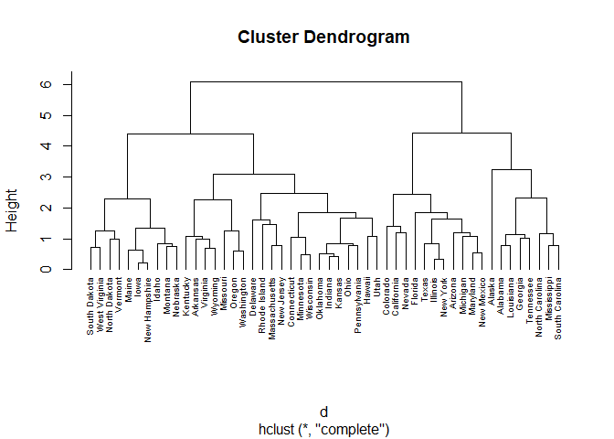

Misalnya kita akan membaginya menjadi 4 cluster

``` r
sub_grp <- cutree(hc, k =4)
table(sub_grp)
```

    ## sub_grp
    ##  1  2  3  4 
    ##  8 11 21 10

Menyatukan hasil cluster dengan dataset awal

``` r
res <-USArrests %>%
            mutate(cluster = sub_grp)
knitr::kable(head(res, 10))
```

|  Murder|  Assault|  UrbanPop|  Rape|  cluster|
|-------:|--------:|---------:|-----:|--------:|
|    13.2|      236|        58|  21.2|        1|
|    10.0|      263|        48|  44.5|        1|
|     8.1|      294|        80|  31.0|        2|
|     8.8|      190|        50|  19.5|        3|
|     9.0|      276|        91|  40.6|        2|
|     7.9|      204|        78|  38.7|        2|
|     3.3|      110|        77|  11.1|        3|
|     5.9|      238|        72|  15.8|        3|
|    15.4|      335|        80|  31.9|        2|
|    17.4|      211|        60|  25.8|        1|

Melihat Rata-rata tiap Cluster

``` r
res %>% 
      group_by(cluster) %>%
      summarise_all(mean)
```

    ## # A tibble: 4 x 5
    ##   cluster Murder Assault UrbanPop  Rape
    ##     <int>  <dbl>   <dbl>    <dbl> <dbl>
    ## 1       1  14.1    253.      53.5  24.5
    ## 2       2  11.1    264.      79.1  32.6
    ## 3       3   5.87   134.      70.8  18.6
    ## 4       4   3.18    78.7     49.3  11.6

Dari hasil diatas dapat digunakan untuk melakukan cluster profiling.
Dapat juga melihat statistik lainnya seperti median, quantile, min, max,
dan lain-lain

Mewarnai dendogram sesuai cluster

``` r
plot(hc, cex = 0.6)
rect.hclust(hc, k = 4, border = 2:5)
```

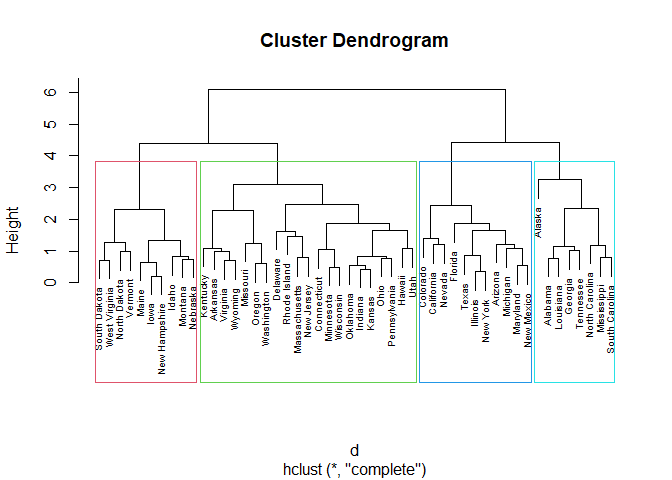

``` r
plot(color_branches(hc, h = 4))
```

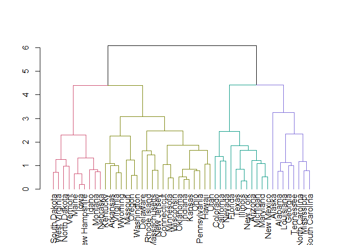

Membuat Scatter Plot Data

``` r
fviz_cluster(list(data = df, cluster = sub_grp))
```

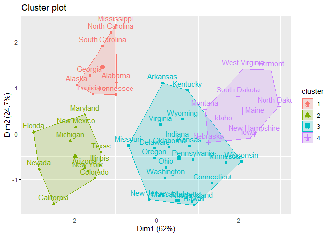

## Divisive Hierarchical Clustering


Method `diana` dapat digunakan untuk melakukan divisive clustering.

``` r
d <- dist(df, method = "manhattan")
hc2 <- diana(d)
pltree(hc2, cex = 0.6, hang = -1, main = "Dendrogram of diana")
```

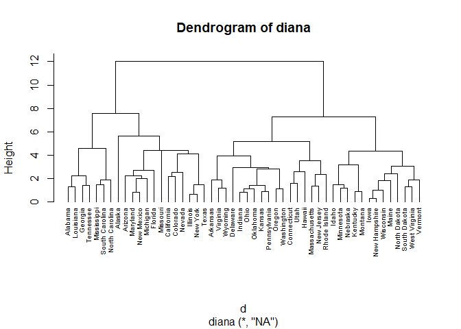

Mengambil 4 cluster

``` r
sub_grp <- cutree(as.hclust(hc2), k = 4)
fviz_cluster(list(data = df, cluster = sub_grp))
```

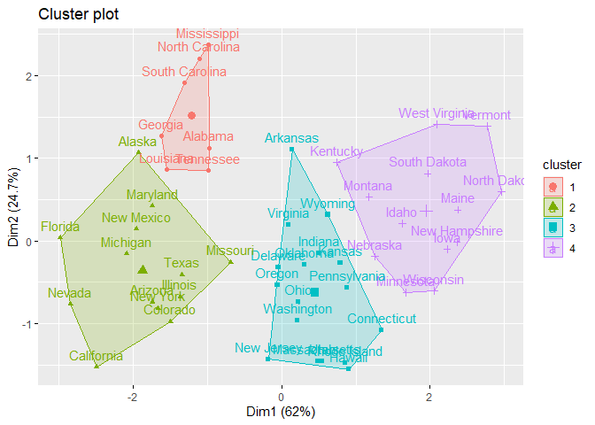

``` r
pltree(hc2, cex = 0.6, hang = -1, main = "Dendrogram of diana")
rect.hclust(hc2, k = 4, border = 2:5)
```

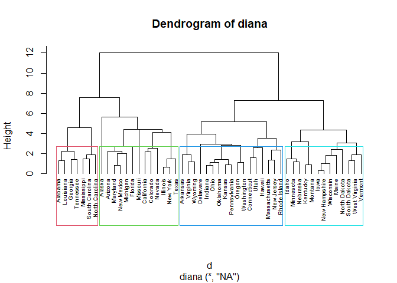

## K-Means Clustering


### Menentukan Jumlah Cluster


#### Elbow Method

``` r
set.seed(1)
fviz_nbclust(df, kmeans, method = "wss")
```

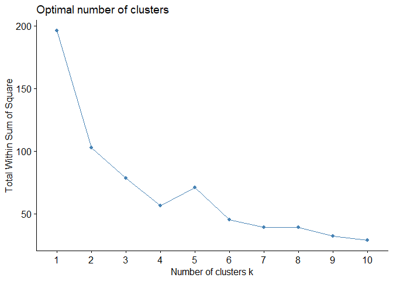

Dari gambar diatas 2 cluster bisa menjadi pilihan yang baik

#### Silhouette method

``` r
set.seed(2723)
fviz_nbclust(df, kmeans, method = "silhouette")
```

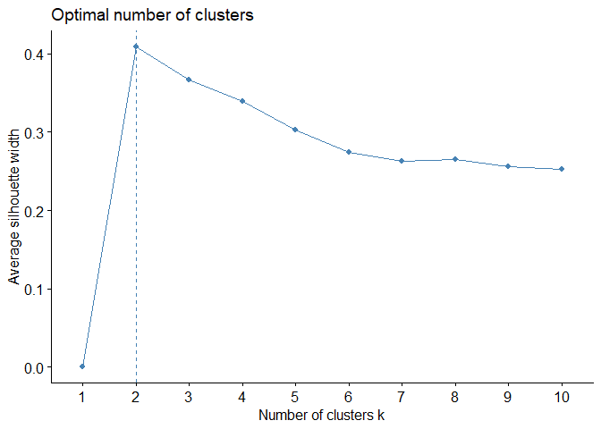

Metode Silhouette menyarankan menggunakan 2 cluster

#### Gap Statistil

``` r
fviz_nbclust(df, kmeans, method = "gap_stat")
```

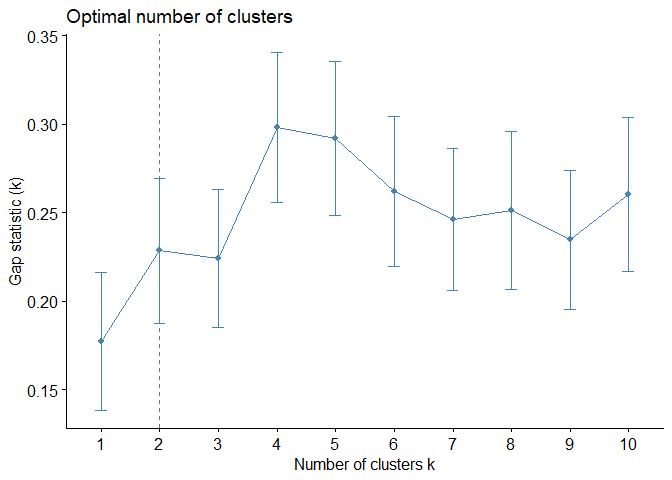

Metode gap statistik juga menyarankan menggunakan 2 cluster. Oleh karena
itu kita akan menggunakan 2 cluster untuk analisis selanjutnya

### Membentuk Cluster


``` r
km <- eclust(df, "kmeans", k = 2, graph = FALSE)
km
```

    ## K-means clustering with 2 clusters of sizes 20, 30
    ## 
    ## Cluster means:
    ##      Murder    Assault   UrbanPop       Rape
    ## 1  1.004934  1.0138274  0.1975853  0.8469650
    ## 2 -0.669956 -0.6758849 -0.1317235 -0.5646433
    ## 
    ## Clustering vector:
    ##        Alabama         Alaska        Arizona       Arkansas     California 
    ##              1              1              1              2              1 
    ##       Colorado    Connecticut       Delaware        Florida        Georgia 
    ##              1              2              2              1              1 
    ##         Hawaii          Idaho       Illinois        Indiana           Iowa 
    ##              2              2              1              2              2 
    ##         Kansas       Kentucky      Louisiana          Maine       Maryland 
    ##              2              2              1              2              1 
    ##  Massachusetts       Michigan      Minnesota    Mississippi       Missouri 
    ##              2              1              2              1              1 
    ##        Montana       Nebraska         Nevada  New Hampshire     New Jersey 
    ##              2              2              1              2              2 
    ##     New Mexico       New York North Carolina   North Dakota           Ohio 
    ##              1              1              1              2              2 
    ##       Oklahoma         Oregon   Pennsylvania   Rhode Island South Carolina 
    ##              2              2              2              2              1 
    ##   South Dakota      Tennessee          Texas           Utah        Vermont 
    ##              2              1              1              2              2 
    ##       Virginia     Washington  West Virginia      Wisconsin        Wyoming 
    ##              2              2              2              2              2 
    ## 
    ## Within cluster sum of squares by cluster:
    ## [1] 46.74796 56.11445
    ##  (between_SS / total_SS =  47.5 %)
    ## 
    ## Available components:
    ## 
    ##  [1] "cluster"      "centers"      "totss"        "withinss"     "tot.withinss"
    ##  [6] "betweenss"    "size"         "iter"         "ifault"       "silinfo"     
    ## [11] "nbclust"      "data"

Kita bisa mengakses beberapa nilai seperti sum square within untuk tiap
cluster dengan mengambil property `withinss`

``` r
km$withinss
```

    ## [1] 46.74796 56.11445

Kita juga dapat menggabung hasil cluster dengan data awal

``` r
res <- USArrests %>%
            mutate(cluster = km$cluster)
knitr::kable(head(res, 10))
```

|  Murder|  Assault|  UrbanPop|  Rape|  cluster|
|-------:|--------:|---------:|-----:|--------:|
|    13.2|      236|        58|  21.2|        1|
|    10.0|      263|        48|  44.5|        1|
|     8.1|      294|        80|  31.0|        1|
|     8.8|      190|        50|  19.5|        2|
|     9.0|      276|        91|  40.6|        1|
|     7.9|      204|        78|  38.7|        1|
|     3.3|      110|        77|  11.1|        2|
|     5.9|      238|        72|  15.8|        2|
|    15.4|      335|        80|  31.9|        1|
|    17.4|      211|        60|  25.8|        1|

### Membuat Visualisasi Cluster


``` r
fviz_cluster(km, geom = "point", ellipse.type = "norm", palette = "jco", ggtheme = theme_minimal())
```

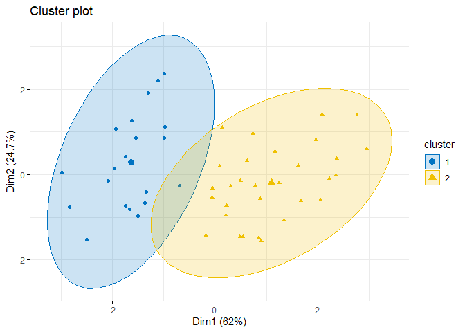

``` r
fviz_cluster(km, palette = "jco", ggtheme = theme_minimal())
```

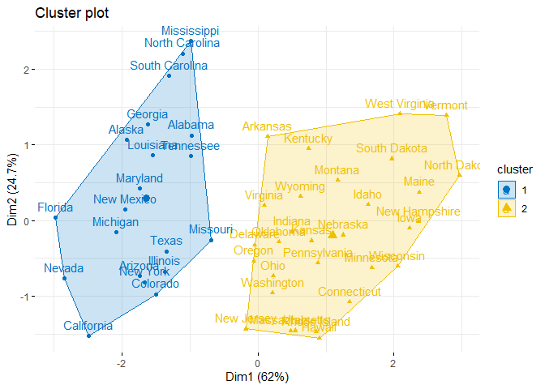

## Cluster Profiling


**Contoh ini sama dengan modul pembelajaran.**

Seorang peneliti ingin mengelompokkan kabupaten/kota di Jawa Timur
berdasarkan indikator kesejahteraan sosial dan kemudian melakukan
profiling dari klister yang terbentuk. Data yang dikumpulkan memiliki
variable-variabel berikut:

-   Gini = gini ratio
-   Padat = kepadatan penduduk
-   AHH = Angka harapan hidup
-   AMH = angka melek huruf
-   P1 = Head count index
-   Petani = banyaknya petani
-   pdrb\_kap = PDRB per kapita
-   status = status kesejahteraan kab/kota (1-sejahtera, 2-menengah,
    3-kurang sejahtera)
-   pesisir = status wilayah pesisir (1-pesisir, 2-bukan pesisir)

Maka lakukan analisis yg perlu dilakukan peneliti tersebut!

### Memilih Variabel


Peneliti ingin melakukan analisis pengelompokan berdasarkan indikator
kesejahteraan social maka variable yg dipilih: Gini, AHH, AMH, dan P1
(dalam riil penelitian harus berdasarkan kajian teori).

``` r
data <- read.csv("cluster_jatim.csv", row.names = 1)
df <- data[,c(1,3,4,5)]
df <- scale(df)
knitr::kable(head(df, 10))
```

|                  |        Gini|         AHH|         AMH|          P1|
|:-----------------|-----------:|-----------:|-----------:|-----------:|
| ab. Pacitan      |   0.5940323|   0.9694417|   0.0352750|   0.8043983|
| Kab. Ponorogo    |   1.5754769|   0.5477204|  -0.6330194|  -0.1189699|
| Kab. Trenggalek  |   1.5754769|   1.0170043|   0.3906686|   0.1958583|
| Kab. Tulungagung |   0.2668841|   0.9187083|   0.8600199|  -0.6660800|
| Kab. Blitar      |   0.5940323|   0.8489499|   0.4061205|  -0.3781273|
| Kab. Kediri      |  -0.0602641|   0.4843036|   0.5123523|   0.1325087|
| Kab. Malang      |   1.2483287|   0.1830741|   0.2998887|  -0.2034360|
| Kab. Lumajang    |  -1.0417088|  -0.3718224|  -0.6117730|  -0.0767369|
| Kab. Jember      |  -0.3874124|  -1.7384531|  -0.7662920|  -0.1650423|
| Kab. Banyuwangi  |  -0.3874124|  -0.1720596|  -0.1984349|  -0.5624170|

### Menentukan Jumlah Cluster


Silahkan gunakan elbow method, sillhouette method atau gap statistik
untuk menentukan jumlah klaster terbaik. Akan tetapi karena kita akan
menjadikan variabel `status` menjadi Ground Truth maka kita pilih jumlah
cluster sebanyak 3 sesuai dengan banyaknya status

### Lakukan Clustering


``` r
set.seed(1)
km <- eclust(df, "kmeans", k = 3, nstart = 25, graph = FALSE)
km
```

    ## K-means clustering with 3 clusters of sizes 16, 14, 8
    ## 
    ## Cluster means:
    ##         Gini        AHH        AMH          P1
    ## 1 -0.3260721  0.2320239  0.2246815  0.06304016
    ## 2  0.8744451  0.6435250  0.5919572 -0.77920422
    ## 3 -0.8781347 -1.5902165 -1.4852880  1.23752706
    ## 
    ## Clustering vector:
    ##      ab. Pacitan    Kab. Ponorogo  Kab. Trenggalek Kab. Tulungagung 
    ##                1                2                2                2 
    ##      Kab. Blitar      Kab. Kediri      Kab. Malang    Kab. Lumajang 
    ##                2                1                2                1 
    ##      Kab. Jember  Kab. Banyuwangi   Kab. Bondowoso   Kab. Situbondo 
    ##                3                1                3                3 
    ## Kab. Probolinggo    Kab. Pasuruan    Kab. Sidoarjo   Kab. Mojokerto 
    ##                3                1                2                1 
    ##     Kab. Jombang     Kab. Nganjuk      Kab. Madiun     Kab. Magetan 
    ##                1                1                2                1 
    ##       Kab. Ngawi  Kab. Bojonegoro       Kab. Tuban    Kab. Lamongan 
    ##                1                1                1                1 
    ##      Kab. Gresik   Kab. Bangkalan     Kab. Sampang   Kab. Pamekasan 
    ##                1                3                3                3 
    ##     Kab. Sumenep      Kota Kediri      Kota Blitar      Kota Malang 
    ##                3                2                2                2 
    ## Kota Probolinggo    Kota Pasuruan   Kota Mojokerto      Kota Madiun 
    ##                1                1                2                2 
    ##    Kota Surabaya        Kota Batu 
    ##                2                2 
    ## 
    ## Within cluster sum of squares by cluster:
    ## [1] 21.08482 19.89143 17.38132
    ##  (between_SS / total_SS =  60.6 %)
    ## 
    ## Available components:
    ## 
    ##  [1] "cluster"      "centers"      "totss"        "withinss"     "tot.withinss"
    ##  [6] "betweenss"    "size"         "iter"         "ifault"       "silinfo"     
    ## [11] "nbclust"      "data"

### Profiling


#### Internal

``` r
fviz_cluster(km, 
             geom = "point", 
             ellipse.type = "norm", 
             palette = "jco", 
             ggtheme = theme_minimal())
```

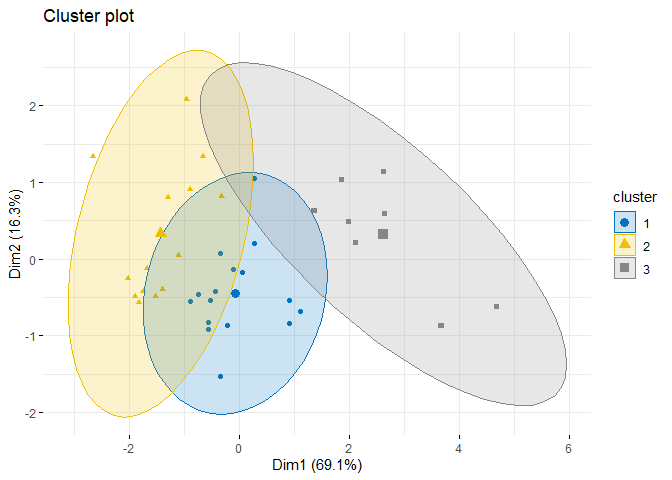

``` r
data[,c(1,3,4,5)] %>%
      mutate(cluster = km$cluster) %>%
      group_by(cluster) %>%
      summarise_all(mean)
```

    ## # A tibble: 3 x 5
    ##   cluster  Gini   AHH   AMH    P1
    ##     <int> <dbl> <dbl> <dbl> <dbl>
    ## 1       1 0.322  69.9  93.6 12.9 
    ## 2       2 0.359  71.2  95.5  8.48
    ## 3       3 0.305  64.1  84.7 19.0

Jika kita lihat dari cluster mean terlihat bahwa Cluster 1 adalah
kabupaten/kota yang memiliki Gini ratio menengah, AHH menengah, dan AMH
serta persentase penduduk miskin juga menengah, sehingga bisa kita
katakan Cluster 1 adalah kabupaten/kota dengan tingkat kesejahteraan
menengah.

Sedangkan Cluster 2 memiliki nilai Gini Ratio tinggi, AHH dan AMH tinggi
sedangkan P1 rendah, artinya Cluster 2 adalah kabupaten/kota dengan
tingkat kesejahteraan tinggi namun memiliki ketimpangan yang tinggi.

Sedangkan Cluster 3 adalah kabupaten/kota dengan tingkat kesejahteraan
yang rendah.

#### External (Menggunakan variabel lain)

Selain itu kita juga bisa membuat profil cluster dengan variable
eksternal missal seperti berikut:

``` r
data %>% 
      select(Petani, Padat) %>%
      mutate(cluster = as.character(km$cluster)) %>%
      ggplot(aes(x = Petani, y = Padat, color = cluster)) +
      geom_point() +
      theme_minimal()
```

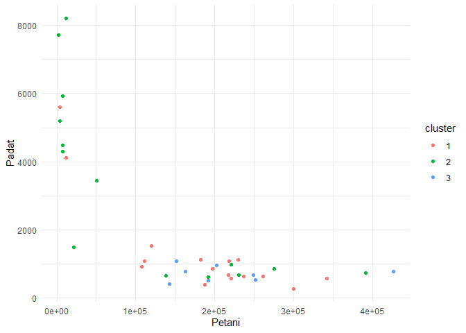

Terlihat bahwa cluster 2 umumnya adalah kelompok kabupaten/kota dengan
kepadatan penduduk tinggi dan jumlah petani yang sedikit, sedangkan
antara cluster 1 dan 3 relatif tidak berbeda.

### Evaluasi Cluster


#### Visualisasi Sillhouette

``` r
sil <- silhouette(km$cluster, dist(df))
fviz_silhouette(sil)
```

    ##   cluster size ave.sil.width
    ## 1       1   16          0.23
    ## 2       2   14          0.26
    ## 3       3    8          0.36

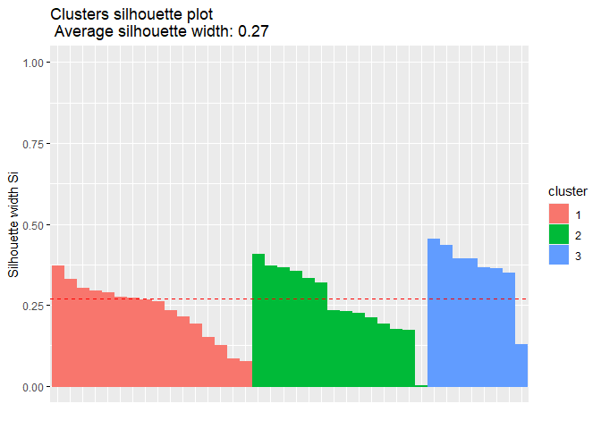

Terlihat bahwa meski silhouette dibawah 0.5 namun semua observasinya
memiliki silhouette positif (\>0) sehingga meskipun klaster yang
terbentuk relative belum cukup compact namun setidaknya penempatan semua
observasi ke dalam cluster sudah tepat.

``` r
knitr::kable(head(km$silinfo$widths,10))
```

|                 | cluster |  neighbor|  sil\_width|
|:----------------|:--------|---------:|-----------:|
| Kab. Lamongan   | 1       |         3|   0.3720490|
| Kab. Gresik     | 1       |         2|   0.3290740|
| Kab. Kediri     | 1       |         2|   0.3037422|
| Kab. Magetan    | 1       |         2|   0.2935829|
| Kab. Banyuwangi | 1       |         2|   0.2880704|
| Kab. Lumajang   | 1       |         3|   0.2741279|
| Kab. Nganjuk    | 1       |         2|   0.2719497|
| Kab. Tuban      | 1       |         2|   0.2664704|
| Kab. Bojonegoro | 1       |         3|   0.2600357|
| Kab. Ngawi      | 1       |         2|   0.2331198|

Tabel diatas merupakan nilai silhouette untuk tiap observasi. Berikut
nilai rat-rata untuk tiap cluster

``` r
km$silinfo$clus.avg.widths
```

    ## [1] 0.2336656 0.2567775 0.3610912

Rata-rata totalnya

``` r
km$silinfo$avg.width
```

    ## [1] 0.269007

Untuk melihat nilai silhouette yang lebih kecil dari 0

``` r
km$silinfo$widths %>%
      filter(sil_width < 0)
```

    ## [1] cluster   neighbor  sil_width
    ## <0 rows> (or 0-length row.names)

Terlihat tidak ada yang bernilai negatif

#### Dunn Index

``` r
km_stats <- cluster.stats(dist(df), km$cluster)
km_stats$dunn
```

    ## [1] 0.1399037

Dunn index digunakan untuk membandingkan beberapa parameter cluster yang
berbeda, missal membandingkan untuk k = 2, k = 3 dan k = 4.

Hasil dari `cluster.stats` juga sangat beragam. Berikut nilai yang dapat
kita peroleh

``` r
km_stats
```

    ## $n
    ## [1] 38
    ## 
    ## $cluster.number
    ## [1] 3
    ## 
    ## $cluster.size
    ## [1] 16 14  8
    ## 
    ## $min.cluster.size
    ## [1] 8
    ## 
    ## $noisen
    ## [1] 0
    ## 
    ## $diameter
    ## [1] 3.094367 2.938821 4.086305
    ## 
    ## $average.distance
    ## [1] 1.572477 1.586161 2.031767
    ## 
    ## $median.distance
    ## [1] 1.602725 1.724613 1.962717
    ## 
    ## $separation
    ## [1] 0.5716894 0.5716894 1.3322486
    ## 
    ## $average.toother
    ## [1] 2.547322 2.882125 3.748326
    ## 
    ## $separation.matrix
    ##           [,1]      [,2]     [,3]
    ## [1,] 0.0000000 0.5716894 1.332249
    ## [2,] 0.5716894 0.0000000 2.370039
    ## [3,] 1.3322486 2.3700391 0.000000
    ## 
    ## $ave.between.matrix
    ##          [,1]     [,2]     [,3]
    ## [1,] 0.000000 2.155029 3.233834
    ## [2,] 2.155029 0.000000 4.336317
    ## [3,] 3.233834 4.336317 0.000000
    ## 
    ## $average.between
    ## [1] 2.979148
    ## 
    ## $average.within
    ## [1] 1.674211
    ## 
    ## $n.between
    ## [1] 464
    ## 
    ## $n.within
    ## [1] 239
    ## 
    ## $max.diameter
    ## [1] 4.086305
    ## 
    ## $min.separation
    ## [1] 0.5716894
    ## 
    ## $within.cluster.ss
    ## [1] 58.35756
    ## 
    ## $clus.avg.silwidths
    ##         1         2         3 
    ## 0.2336656 0.2567775 0.3610912 
    ## 
    ## $avg.silwidth
    ## [1] 0.269007
    ## 
    ## $g2
    ## NULL
    ## 
    ## $g3
    ## NULL
    ## 
    ## $pearsongamma
    ## [1] 0.4977893
    ## 
    ## $dunn
    ## [1] 0.1399037
    ## 
    ## $dunn2
    ## [1] 1.060667
    ## 
    ## $entropy
    ## [1] 1.060119
    ## 
    ## $wb.ratio
    ## [1] 0.5619765
    ## 
    ## $ch
    ## [1] 26.88157
    ## 
    ## $cwidegap
    ## [1] 1.598324 1.724613 2.205082
    ## 
    ## $widestgap
    ## [1] 2.205082
    ## 
    ## $sindex
    ## [1] 0.6129577
    ## 
    ## $corrected.rand
    ## NULL
    ## 
    ## $vi
    ## NULL

#### Validasi Eksternal

Validasi eksternal dengan menggunakan ground truth variabel `status`

1.  Sejahtera
2.  Menengah
3.  Kurang sejahtera

##### Sesuaikan Hasil Cluster

Berdasarkan cluster profiling diperoleh bahwa cluster 1 adalah kabupaten
menengah, cluster 2 sejahtera dan, cluster 3 kurang sejahtera.

``` r
clus <- c()
for (i in 1:length(km$cluster)){
      if(km$cluster[i] == 1)
            clus[i] <- 2
      else if(km$cluster[i] == 2)
            clus[i] <- 1
      else
            clus[i] <- 3
}
      
clus
```

    ##  [1] 2 1 1 1 1 2 1 2 3 2 3 3 3 2 1 2 2 2 1 2 2 2 2 2 2 3 3 3 3 1 1 1 2 2 1 1 1 1

##### Corrected Rand index

``` r
ground <- data$Status
clust_stats <- cluster.stats(d = dist(df), ground, clus)
clust_stats$corrected.rand
```

    ## [1] 0.1622974

##### Tabel Kontigensi

``` r
table(data$Status, clus)
```

    ##    clus
    ##     1 2 3
    ##   1 9 3 0
    ##   2 3 9 2
    ##   3 2 4 6

Terlihat bahwa ternyata masih ada data yang tidak terkluster sesuai
dengan varibel `Status`. Yang sesuai ada sebanyak 24 observasi, yaitu

``` r
data %>%
      mutate(cluster = clus,
             kab = rownames(data)) %>%
      select(kab, Status, cluster) %>%
      filter(Status == cluster) %>%
      knitr::kable()
```

| kab              |  Status|  cluster|
|:-----------------|-------:|--------:|
| Kab. Kediri      |       2|        2|
| Kab. Malang      |       1|        1|
| Kab. Lumajang    |       2|        2|
| Kab. Bondowoso   |       3|        3|
| Kab. Probolinggo |       3|        3|
| Kab. Pasuruan    |       2|        2|
| Kab. Sidoarjo    |       1|        1|
| Kab. Mojokerto   |       2|        2|
| Kab. Jombang     |       2|        2|
| Kab. Bojonegoro  |       2|        2|
| Kab. Tuban       |       2|        2|
| Kab. Lamongan    |       2|        2|
| Kab. Gresik      |       2|        2|
| Kab. Bangkalan   |       3|        3|
| Kab. Sampang     |       3|        3|
| Kab. Pamekasan   |       3|        3|
| Kab. Sumenep     |       3|        3|
| Kota Kediri      |       1|        1|
| Kota Blitar      |       1|        1|
| Kota Malang      |       1|        1|
| Kota Mojokerto   |       1|        1|
| Kota Madiun      |       1|        1|
| Kota Surabaya    |       1|        1|
| Kota Batu        |       1|        1|

Sedangkan yang tidak sesuai sebanyak 14 observasi

``` r
data %>%
      mutate(cluster = clus,
             kab = rownames(data)) %>%
      select(kab, Status, cluster) %>%
      filter(Status != cluster) %>%
      knitr::kable()
```

| kab              |  Status|  cluster|
|:-----------------|-------:|--------:|
| ab. Pacitan      |       3|        2|
| Kab. Ponorogo    |       2|        1|
| Kab. Trenggalek  |       3|        1|
| Kab. Tulungagung |       3|        1|
| Kab. Blitar      |       2|        1|
| Kab. Jember      |       2|        3|
| Kab. Banyuwangi  |       1|        2|
| Kab. Situbondo   |       2|        3|
| Kab. Nganjuk     |       3|        2|
| Kab. Madiun      |       2|        1|
| Kab. Magetan     |       3|        2|
| Kab. Ngawi       |       3|        2|
| Kota Probolinggo |       1|        2|
| Kota Pasuruan    |       1|        2|


