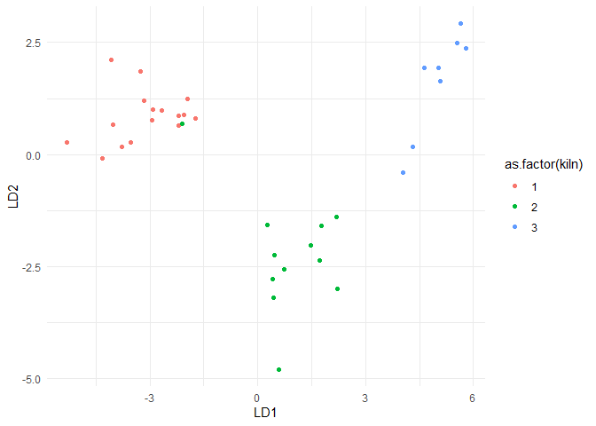

# Analisis Diskriminan  


``` r
library(MASS)
library(tidyverse)
library(caret)
library(MVN)
library("biotools")
```

## Contoh I


### Bagi Data


``` r
data("iris")
set.seed(123)
training.samples <- iris$Species %>%
  createDataPartition(p = 0.8, list = FALSE)
train.data <- iris[training.samples, ]
test.data <- iris[-training.samples, ]
```

### Buat Model


``` r
model <- lda(Species~ Sepal.Length + Sepal.Width, data = train.data)
model
```

    ## Call:
    ## lda(Species ~ Sepal.Length + Sepal.Width, data = train.data)
    ## 
    ## Prior probabilities of groups:
    ##     setosa versicolor  virginica 
    ##  0.3333333  0.3333333  0.3333333 
    ## 
    ## Group means:
    ##            Sepal.Length Sepal.Width
    ## setosa           4.9800      3.3700
    ## versicolor       5.9400      2.7700
    ## virginica        6.6375      3.0125
    ## 
    ## Coefficients of linear discriminants:
    ##                    LD1        LD2
    ## Sepal.Length -2.061627 -0.7171677
    ## Sepal.Width   2.704919 -2.2839070
    ## 
    ## Proportion of trace:
    ##    LD1    LD2 
    ## 0.9503 0.0497

### Lakukan Prediksi


``` r
predictions <- model %>% predict(test.data)
predictions$class
```

    ##  [1] setosa     setosa     setosa     setosa     setosa     setosa    
    ##  [7] setosa     setosa     setosa     setosa     virginica  versicolor
    ## [13] versicolor versicolor versicolor virginica  versicolor versicolor
    ## [19] versicolor versicolor virginica  virginica  virginica  virginica 
    ## [25] virginica  versicolor versicolor versicolor virginica  versicolor
    ## Levels: setosa versicolor virginica

### Akurasi


``` r
mean(predictions$class==test.data$Species)
```

    ## [1] 0.8

## Contoh II


### Import Data


``` r
pot <- read.csv("pottery2.csv")
knitr::kable(head(pot, 10))
```

<table>
<thead>
<tr>
<th style="text-align:right;">
Al2O3
</th>
<th style="text-align:right;">
Fe2O3
</th>
<th style="text-align:right;">
MgO
</th>
<th style="text-align:right;">
CaO
</th>
<th style="text-align:right;">
Na2O
</th>
<th style="text-align:right;">
K2O
</th>
<th style="text-align:right;">
TiO2
</th>
<th style="text-align:right;">
MnO
</th>
<th style="text-align:right;">
BaO
</th>
<th style="text-align:right;">
kiln
</th>
</tr>
</thead>
<tbody>
<tr>
<td style="text-align:right;">
18.8
</td>
<td style="text-align:right;">
9.52
</td>
<td style="text-align:right;">
2.00
</td>
<td style="text-align:right;">
0.79
</td>
<td style="text-align:right;">
0.40
</td>
<td style="text-align:right;">
3.20
</td>
<td style="text-align:right;">
1.01
</td>
<td style="text-align:right;">
0.077
</td>
<td style="text-align:right;">
0.015
</td>
<td style="text-align:right;">
1
</td>
</tr>
<tr>
<td style="text-align:right;">
16.9
</td>
<td style="text-align:right;">
7.33
</td>
<td style="text-align:right;">
1.65
</td>
<td style="text-align:right;">
0.84
</td>
<td style="text-align:right;">
0.40
</td>
<td style="text-align:right;">
3.05
</td>
<td style="text-align:right;">
0.99
</td>
<td style="text-align:right;">
0.067
</td>
<td style="text-align:right;">
0.018
</td>
<td style="text-align:right;">
1
</td>
</tr>
<tr>
<td style="text-align:right;">
18.2
</td>
<td style="text-align:right;">
7.64
</td>
<td style="text-align:right;">
1.82
</td>
<td style="text-align:right;">
0.77
</td>
<td style="text-align:right;">
0.40
</td>
<td style="text-align:right;">
3.07
</td>
<td style="text-align:right;">
0.98
</td>
<td style="text-align:right;">
0.087
</td>
<td style="text-align:right;">
0.014
</td>
<td style="text-align:right;">
1
</td>
</tr>
<tr>
<td style="text-align:right;">
16.9
</td>
<td style="text-align:right;">
7.29
</td>
<td style="text-align:right;">
1.56
</td>
<td style="text-align:right;">
0.76
</td>
<td style="text-align:right;">
0.40
</td>
<td style="text-align:right;">
3.05
</td>
<td style="text-align:right;">
1.00
</td>
<td style="text-align:right;">
0.063
</td>
<td style="text-align:right;">
0.019
</td>
<td style="text-align:right;">
1
</td>
</tr>
<tr>
<td style="text-align:right;">
17.8
</td>
<td style="text-align:right;">
7.24
</td>
<td style="text-align:right;">
1.83
</td>
<td style="text-align:right;">
0.92
</td>
<td style="text-align:right;">
0.43
</td>
<td style="text-align:right;">
3.12
</td>
<td style="text-align:right;">
0.93
</td>
<td style="text-align:right;">
0.061
</td>
<td style="text-align:right;">
0.019
</td>
<td style="text-align:right;">
1
</td>
</tr>
<tr>
<td style="text-align:right;">
18.8
</td>
<td style="text-align:right;">
7.45
</td>
<td style="text-align:right;">
2.06
</td>
<td style="text-align:right;">
0.87
</td>
<td style="text-align:right;">
0.25
</td>
<td style="text-align:right;">
3.26
</td>
<td style="text-align:right;">
0.98
</td>
<td style="text-align:right;">
0.072
</td>
<td style="text-align:right;">
0.017
</td>
<td style="text-align:right;">
1
</td>
</tr>
<tr>
<td style="text-align:right;">
16.5
</td>
<td style="text-align:right;">
7.05
</td>
<td style="text-align:right;">
1.81
</td>
<td style="text-align:right;">
1.73
</td>
<td style="text-align:right;">
0.33
</td>
<td style="text-align:right;">
3.20
</td>
<td style="text-align:right;">
0.95
</td>
<td style="text-align:right;">
0.066
</td>
<td style="text-align:right;">
0.019
</td>
<td style="text-align:right;">
1
</td>
</tr>
<tr>
<td style="text-align:right;">
18.0
</td>
<td style="text-align:right;">
7.42
</td>
<td style="text-align:right;">
2.06
</td>
<td style="text-align:right;">
1.00
</td>
<td style="text-align:right;">
0.28
</td>
<td style="text-align:right;">
3.37
</td>
<td style="text-align:right;">
0.96
</td>
<td style="text-align:right;">
0.072
</td>
<td style="text-align:right;">
0.017
</td>
<td style="text-align:right;">
1
</td>
</tr>
<tr>
<td style="text-align:right;">
15.8
</td>
<td style="text-align:right;">
7.15
</td>
<td style="text-align:right;">
1.62
</td>
<td style="text-align:right;">
0.71
</td>
<td style="text-align:right;">
0.38
</td>
<td style="text-align:right;">
3.25
</td>
<td style="text-align:right;">
0.93
</td>
<td style="text-align:right;">
0.062
</td>
<td style="text-align:right;">
0.017
</td>
<td style="text-align:right;">
1
</td>
</tr>
<tr>
<td style="text-align:right;">
14.6
</td>
<td style="text-align:right;">
6.87
</td>
<td style="text-align:right;">
1.67
</td>
<td style="text-align:right;">
0.76
</td>
<td style="text-align:right;">
0.33
</td>
<td style="text-align:right;">
3.06
</td>
<td style="text-align:right;">
0.91
</td>
<td style="text-align:right;">
0.055
</td>
<td style="text-align:right;">
0.012
</td>
<td style="text-align:right;">
1
</td>
</tr>
</tbody>
</table>

### Rubah Target Data jadi Factor


``` r
pot$kiln <- as.factor(pot$kiln)
summary(pot)
```

    ##      Al2O3           Fe2O3            MgO             CaO        
    ##  Min.   :10.10   Min.   :0.920   Min.   :0.530   Min.   :0.0100  
    ##  1st Qu.:13.80   1st Qu.:5.390   1st Qu.:1.560   1st Qu.:0.1300  
    ##  Median :16.50   Median :6.920   Median :1.920   Median :0.3000  
    ##  Mean   :15.71   Mean   :5.756   Mean   :2.488   Mean   :0.5136  
    ##  3rd Qu.:18.00   3rd Qu.:7.330   3rd Qu.:3.770   3rd Qu.:0.8300  
    ##  Max.   :20.80   Max.   :9.520   Max.   :7.230   Max.   :1.7300  
    ##       Na2O             K2O            TiO2             MnO         
    ##  Min.   :0.0300   Min.   :1.75   Min.   :0.5600   Min.   :0.00100  
    ##  1st Qu.:0.1000   1st Qu.:2.93   1st Qu.:0.7200   1st Qu.:0.03500  
    ##  Median :0.2000   Median :3.15   Median :0.9100   Median :0.07200  
    ##  Mean   :0.2429   Mean   :3.20   Mean   :0.8767   Mean   :0.07051  
    ##  3rd Qu.:0.3800   3rd Qu.:3.70   3rd Qu.:0.9800   3rd Qu.:0.09400  
    ##  Max.   :0.8300   Max.   :4.89   Max.   :1.3400   Max.   :0.16300  
    ##       BaO          kiln  
    ##  Min.   :0.00900   1:20  
    ##  1st Qu.:0.01500   2:13  
    ##  Median :0.01700   3:12  
    ##  Mean   :0.01651         
    ##  3rd Qu.:0.01900         
    ##  Max.   :0.02300

### Uji Untuk Melihat Perbedaan


``` r
mnv <- manova(cbind(Al2O3,Fe2O3,MgO,CaO,Na2O,K2O,TiO2,MnO,BaO)~kiln, data=pot)
summary(mnv)
```

    ##           Df Pillai approx F num Df den Df    Pr(>F)    
    ## kiln       2 1.6836   20.695     18     70 < 2.2e-16 ***
    ## Residuals 42                                            
    ## ---
    ## Signif. codes:  0 '***' 0.001 '**' 0.01 '*' 0.05 '.' 0.1 ' ' 1

Terligat bahwa tolak *H*<sub>0</sub> sehingga ada perbedaan yang
signifikan

### Uji Asumsi


#### Uji Homogenitas

-   H0 : ∑1=∑2=∑3
-   H1 : Minimal ada satu yang berbeda

``` r
boxM(pot[, -length(pot)], pot[, length(pot)])
```

    ## 
    ##  Box's M-test for Homogeneity of Covariance Matrices
    ## 
    ## data:  pot[, -length(pot)]
    ## Chi-Sq (approx.) = 346.69, df = 90, p-value < 2.2e-16

Tidak memenuhi

#### Uji Normalitas

``` r
mvn(pot[, -length(pot)])
```

    ## $multivariateNormality
    ##              Test         Statistic              p value Result
    ## 1 Mardia Skewness  277.133537048833 1.05266596483199e-07     NO
    ## 2 Mardia Kurtosis 0.643239375208534    0.520068787353269    YES
    ## 3             MVN              <NA>                 <NA>     NO
    ## 
    ## $univariateNormality
    ##           Test  Variable Statistic   p value Normality
    ## 1 Shapiro-Wilk   Al2O3      0.9458  0.0352      NO    
    ## 2 Shapiro-Wilk   Fe2O3      0.8070  <0.001      NO    
    ## 3 Shapiro-Wilk    MgO       0.8670   1e-04      NO    
    ## 4 Shapiro-Wilk    CaO       0.8805   2e-04      NO    
    ## 5 Shapiro-Wilk   Na2O       0.9143  0.0027      NO    
    ## 6 Shapiro-Wilk    K2O       0.9386  0.0191      NO    
    ## 7 Shapiro-Wilk   TiO2       0.9467  0.0383      NO    
    ## 8 Shapiro-Wilk    MnO       0.9325  0.0116      NO    
    ## 9 Shapiro-Wilk    BaO       0.9824  0.7168      YES   
    ## 
    ## $Descriptives
    ##        n        Mean     Std.Dev Median    Min    Max   25th   75th        Skew
    ## Al2O3 45 15.70888889 2.703013657 16.500 10.100 20.800 13.800 18.000 -0.37467668
    ## Fe2O3 45  5.75622222 2.405811419  6.920  0.920  9.520  5.390  7.330 -0.94504825
    ## MgO   45  2.48844444 1.742110731  1.920  0.530  7.230  1.560  3.770  0.92662287
    ## CaO   45  0.51355556 0.454278427  0.300  0.010  1.730  0.130  0.830  0.71967637
    ## Na2O  45  0.24288889 0.178244243  0.200  0.030  0.830  0.100  0.380  0.88614431
    ## K2O   45  3.20000000 0.852725577  3.150  1.750  4.890  2.930  3.700  0.11120514
    ## TiO2  45  0.87666667 0.179810506  0.910  0.560  1.340  0.720  0.980  0.37222550
    ## MnO   45  0.07051111 0.046801137  0.072  0.001  0.163  0.035  0.094  0.07573141
    ## BaO   45  0.01651111 0.002981932  0.017  0.009  0.023  0.015  0.019 -0.25722580
    ##          Kurtosis
    ## Al2O3 -0.99975057
    ## Fe2O3 -0.58982936
    ## MgO   -0.17937201
    ## CaO   -0.36077408
    ## Na2O   0.64002428
    ## K2O   -0.82108483
    ## TiO2   0.01789675
    ## MnO   -0.71297643
    ## BaO   -0.12472728

Terlihat dat tidak semuanya berdistribusi normal. Tapi yah seperti biasa
kita akan tetap menganggapnya normal

### Buat Model


``` r
set.seed(2723)

k <- length(levels(pot$kiln))
n <- nrow(pot)

idx <- sample(1:n, 36)
pot.tr <- pot[idx,] #data training
pot.ts <- pot[-idx,] #data testing

fit<-lda(kiln~.,data=pot.tr)
fit
```

    ## Call:
    ## lda(kiln ~ ., data = pot.tr)
    ## 
    ## Prior probabilities of groups:
    ##         1         2         3 
    ## 0.4444444 0.3333333 0.2222222 
    ## 
    ## Group means:
    ##      Al2O3    Fe2O3      MgO       CaO    Na2O     K2O      TiO2       MnO
    ## 1 17.07500 7.468125 1.849375 0.9000000 0.35625 3.09125 0.9443750 0.0705000
    ## 2 13.11667 6.489167 4.715000 0.2441667 0.24500 4.05000 0.7233333 0.1199167
    ## 3 16.16250 2.606250 1.445000 0.1075000 0.04875 2.66625 0.9050000 0.0273750
    ##          BaO
    ## 1 0.01718750
    ## 2 0.01633333
    ## 3 0.01637500
    ## 
    ## Coefficients of linear discriminants:
    ##                LD1          LD2
    ## Al2O3   0.01773401   0.08827479
    ## Fe2O3  -1.36402037  -0.36689459
    ## MgO    -0.44466740  -0.92454938
    ## CaO    -2.16902956   1.28907580
    ## Na2O   -3.29482795   1.45325233
    ## K2O     2.60977168   1.40808846
    ## TiO2    2.61558220   0.15232051
    ## MnO     4.90503316 -16.53785696
    ## BaO   -41.13035400 -78.90725503
    ## 
    ## Proportion of trace:
    ##    LD1    LD2 
    ## 0.7982 0.2018

Dari hasil diatas bisa dilihat prior yang digunakan, koefisien
diskriminannya dan juga proporsi of trace untuk setiap diskriminan yang
dibuat

### Scores


``` r
zscore <- predict(fit,pot[,-10])
knitr::kable(head(zscore$x, 10))
```

<table>
<thead>
<tr>
<th style="text-align:right;">
LD1
</th>
<th style="text-align:right;">
LD2
</th>
</tr>
</thead>
<tbody>
<tr>
<td style="text-align:right;">
-5.298834
</td>
<td style="text-align:right;">
0.2632967
</td>
</tr>
<tr>
<td style="text-align:right;">
-2.914361
</td>
<td style="text-align:right;">
1.0015170
</td>
</tr>
<tr>
<td style="text-align:right;">
-2.949253
</td>
<td style="text-align:right;">
0.7666386
</td>
</tr>
<tr>
<td style="text-align:right;">
-2.680852
</td>
<td style="text-align:right;">
0.9850435
</td>
</tr>
<tr>
<td style="text-align:right;">
-3.172857
</td>
<td style="text-align:right;">
1.2040364
</td>
</tr>
<tr>
<td style="text-align:right;">
-2.209957
</td>
<td style="text-align:right;">
0.8572242
</td>
</tr>
<tr>
<td style="text-align:right;">
-4.069667
</td>
<td style="text-align:right;">
2.1093105
</td>
</tr>
<tr>
<td style="text-align:right;">
-2.329280
</td>
<td style="text-align:right;">
1.1606320
</td>
</tr>
<tr>
<td style="text-align:right;">
-1.945510
</td>
<td style="text-align:right;">
1.2356223
</td>
</tr>
<tr>
<td style="text-align:right;">
-1.927660
</td>
<td style="text-align:right;">
1.4177048
</td>
</tr>
</tbody>
</table>

### Korelasi


korelasi antara var original dengan discriminant score

``` r
kor1 <- t(cor(zscore$x[,1],pot[,-10]))
kor2 <- t(cor(zscore$x[,2],pot[,-10]))
tabkor<-data.frame(kor1,kor2)
tabkor
```

    ##              kor1       kor2
    ## Al2O3 -0.10030646  0.7106396
    ## Fe2O3 -0.88807959 -0.4374918
    ## MgO   -0.05381450 -0.9407781
    ## CaO   -0.85805557  0.2097099
    ## Na2O  -0.71999888 -0.2026527
    ## K2O   -0.23354599 -0.7850241
    ## TiO2  -0.04728078  0.6282423
    ## MnO   -0.39854806 -0.8421592
    ## BaO   -0.24933719 -0.0256067

### Lakukan Prediksi


``` r
pred <- predict(fit,pot.ts[,-10])
pred
```

    ## $class
    ## [1] 1 1 1 1 2 3 3 3 3
    ## Levels: 1 2 3
    ## 
    ## $posterior
    ##               1            2            3
    ## 8  9.999774e-01 2.264907e-05 1.384749e-12
    ## 10 9.999492e-01 5.076766e-05 4.445380e-11
    ## 13 9.999999e-01 7.311124e-08 5.118855e-17
    ## 18 1.000000e+00 8.610349e-10 4.094144e-23
    ## 30 1.074428e-05 9.999003e-01 8.892661e-05
    ## 36 8.423250e-15 9.351898e-09 1.000000e+00
    ## 37 6.062346e-15 5.003861e-08 9.999999e-01
    ## 40 4.791178e-22 1.442426e-13 1.000000e+00
    ## 43 2.655797e-17 6.722655e-10 1.000000e+00
    ## 
    ## $x
    ##          LD1        LD2
    ## 8  -2.329279  1.1606320
    ## 10 -1.927660  1.4177048
    ## 13 -3.604057  1.3750530
    ## 18 -5.262002  0.6740115
    ## 30  1.500826 -1.0752507
    ## 36  4.881404  2.4895398
    ## 37  4.973003  1.9566561
    ## 40  6.860538  3.2287836
    ## 43  5.597757  2.4003819

``` r
ct <- table(pot.ts$kiln, pred$class)
ct
```

    ##    
    ##     1 2 3
    ##   1 4 0 0
    ##   2 0 1 0
    ##   3 0 0 4

Terlihat bahwa model berhasil mengklasifikasikan semua data dengan benar

``` r
sum(diag(prop.table(ct)))
```

    ## [1] 1

``` r
lda.data <- cbind(pot.tr, predict(fit)$x)

ggplot(lda.data, aes(LD1, LD2)) +
      geom_point(aes(color = as.factor(kiln))) +
      theme_minimal()
```



