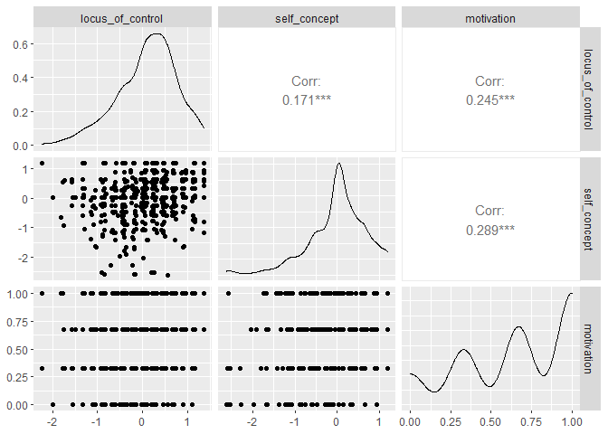

# Analisis Korelasi Kanonik  

``` r
#install.packages("CCA")
#install.packages("CCP")
library(ggplot2)
library(GGally)
library(CCA)
library(CCP)
```

Seorang peneliti mengumpulkan data 3 variabel psikologi, 4 variabel
akademik (standardized test scores) dan gender dari 600 mahasiswa.
Peneliti tertarik untuk melihat hubungan antara variabel psikologi
dengan akademik dan gender. Peneliti tertarik untuk mengetahui berapa
banyak dimensi (variabel kanonik) yang dibutuhkan untuk memahami dua set
variabel tersebut.

## Import Data


``` r
mm <- read.csv("mmreg.csv")
knitr::kable(head(mm, 10))
```

|  locus\_of\_control|  self\_concept|  motivation|  read|  write|  math|  science|  female|
|-------------------:|--------------:|-----------:|-----:|------:|-----:|--------:|-------:|
|               -0.84|          -0.24|        1.00|  54.8|   64.5|  44.5|     52.6|       1|
|               -0.38|          -0.47|        0.67|  62.7|   43.7|  44.7|     52.6|       1|
|                0.89|           0.59|        0.67|  60.6|   56.7|  70.5|     58.0|       0|
|                0.71|           0.28|        0.67|  62.7|   56.7|  54.7|     58.0|       0|
|               -0.64|           0.03|        1.00|  41.6|   46.3|  38.4|     36.3|       1|
|                1.11|           0.90|        0.33|  62.7|   64.5|  61.4|     58.0|       1|
|                0.06|           0.03|        0.67|  41.6|   39.1|  56.3|     45.0|       0|
|               -0.91|          -0.59|        0.67|  44.2|   39.1|  46.3|     36.3|       0|
|                0.45|           0.03|        1.00|  62.7|   51.5|  54.4|     49.8|       1|
|                0.00|           0.03|        0.67|  62.7|   64.5|  38.3|     55.8|       1|

## Eksplore Data


### Summary


``` r
summary(mm)
```

    ##  locus_of_control    self_concept         motivation          read     
    ##  Min.   :-2.23000   Min.   :-2.620000   Min.   :0.0000   Min.   :28.3  
    ##  1st Qu.:-0.37250   1st Qu.:-0.300000   1st Qu.:0.3300   1st Qu.:44.2  
    ##  Median : 0.21000   Median : 0.030000   Median :0.6700   Median :52.1  
    ##  Mean   : 0.09653   Mean   : 0.004917   Mean   :0.6608   Mean   :51.9  
    ##  3rd Qu.: 0.51000   3rd Qu.: 0.440000   3rd Qu.:1.0000   3rd Qu.:60.1  
    ##  Max.   : 1.36000   Max.   : 1.190000   Max.   :1.0000   Max.   :76.0  
    ##      write            math          science          female     
    ##  Min.   :25.50   Min.   :31.80   Min.   :26.00   Min.   :0.000  
    ##  1st Qu.:44.30   1st Qu.:44.50   1st Qu.:44.40   1st Qu.:0.000  
    ##  Median :54.10   Median :51.30   Median :52.60   Median :1.000  
    ##  Mean   :52.38   Mean   :51.85   Mean   :51.76   Mean   :0.545  
    ##  3rd Qu.:59.90   3rd Qu.:58.38   3rd Qu.:58.65   3rd Qu.:1.000  
    ##  Max.   :67.10   Max.   :75.50   Max.   :74.20   Max.   :1.000

3 variabel psikologi adalah `locus_of_control`, `self_concept`, dan
`motivation`. Sementara itu variabel akaedmik `read`, `write`, `math`,
dan `science`

``` r
table(mm$female)
```

    ## 
    ##   0   1 
    ## 273 327

Terdapat sebanyak 327 mahasiswa perempuan

### Korelasi


``` r
psikologi <- mm[, 1:3]
akademik <- mm[, 4:8]

ggpairs(psikologi)
```



``` r
ggpairs(akademik)
```


``` r
matcor(psikologi, akademik)
```

    ## $Xcor
    ##                  locus_of_control self_concept motivation
    ## locus_of_control        1.0000000    0.1711878  0.2451323
    ## self_concept            0.1711878    1.0000000  0.2885707
    ## motivation              0.2451323    0.2885707  1.0000000
    ## 
    ## $Ycor
    ##                read     write       math    science      female
    ## read     1.00000000 0.6285909  0.6792757  0.6906929 -0.04174278
    ## write    0.62859089 1.0000000  0.6326664  0.5691498  0.24433183
    ## math     0.67927568 0.6326664  1.0000000  0.6495261 -0.04821830
    ## science  0.69069291 0.5691498  0.6495261  1.0000000 -0.13818587
    ## female  -0.04174278 0.2443318 -0.0482183 -0.1381859  1.00000000
    ## 
    ## $XYcor
    ##                  locus_of_control self_concept motivation        read
    ## locus_of_control        1.0000000   0.17118778 0.24513227  0.37356505
    ## self_concept            0.1711878   1.00000000 0.28857075  0.06065584
    ## motivation              0.2451323   0.28857075 1.00000000  0.21060992
    ## read                    0.3735650   0.06065584 0.21060992  1.00000000
    ## write                   0.3588768   0.01944856 0.25424818  0.62859089
    ## math                    0.3372690   0.05359770 0.19501347  0.67927568
    ## science                 0.3246269   0.06982633 0.11566948  0.69069291
    ## female                  0.1134108  -0.12595132 0.09810277 -0.04174278
    ##                       write       math     science      female
    ## locus_of_control 0.35887684  0.3372690  0.32462694  0.11341075
    ## self_concept     0.01944856  0.0535977  0.06982633 -0.12595132
    ## motivation       0.25424818  0.1950135  0.11566948  0.09810277
    ## read             0.62859089  0.6792757  0.69069291 -0.04174278
    ## write            1.00000000  0.6326664  0.56914983  0.24433183
    ## math             0.63266640  1.0000000  0.64952612 -0.04821830
    ## science          0.56914983  0.6495261  1.00000000 -0.13818587
    ## female           0.24433183 -0.0482183 -0.13818587  1.00000000

## Korelasi Kanonik


**Nilai yang diperoleh di R ini berbeda tanda dengan yang di SPSS. Saya
tidak tau kenapa**

### Korelasi


``` r
cc1 <- cc(psikologi, akademik)
cc1$cor
```

    ## [1] 0.4640861 0.1675092 0.1039911

Hasil tersebut adalah korelasi perdimensi, terlihat bahwa dimensi
pertama memiliki korelasi yang paling tinggi

#### Uji Signifikansi


``` r
rho <- cc1$cor

n <- nrow(mm) # jumlah observasi
p <- length(psikologi) # jumlah variabel psikologi
q <- length(akademik) # jumlah variabel akademik
```

#### Uji Wilks Lambda

``` r
p.asym(rho, n, p, q, tstat = "Wilks")
```

    ## Wilks' Lambda, using F-approximation (Rao's F):
    ##               stat    approx df1      df2     p.value
    ## 1 to 3:  0.7543611 11.715733  15 1634.653 0.000000000
    ## 2 to 3:  0.9614300  2.944459   8 1186.000 0.002905057
    ## 3 to 3:  0.9891858  2.164612   3  594.000 0.091092180

#### Uji Hotelling

``` r
p.asym(rho, n, p, q, tstat = "Hotelling")
```

    ##  Hotelling-Lawley Trace, using F-approximation:
    ##                stat    approx df1  df2     p.value
    ## 1 to 3:  0.31429738 12.376333  15 1772 0.000000000
    ## 2 to 3:  0.03980175  2.948647   8 1778 0.002806614
    ## 3 to 3:  0.01093238  2.167041   3 1784 0.090013176

#### Uji Pillai

``` r
p.asym(rho, n, p, q, tstat = "Pillai")
```

    ##  Pillai-Bartlett Trace, using F-approximation:
    ##                stat    approx df1  df2     p.value
    ## 1 to 3:  0.25424936 11.000571  15 1782 0.000000000
    ## 2 to 3:  0.03887348  2.934093   8 1788 0.002932565
    ## 3 to 3:  0.01081416  2.163421   3 1794 0.090440474

#### Uji Roy

``` r
p.asym(rho, n, p, q, tstat = "Roy")
```

    ##  Roy's Largest Root, using F-approximation:
    ##               stat   approx df1 df2 p.value
    ## 1 to 1:  0.2153759 32.61008   5 594       0
    ## 
    ##  F statistic for Roy's Greatest Root is an upper bound.

Dengan tingkat signifikansi 5%, terlihat bahwa dari 4 uji, dimensi ke 3
tidak signifikan sebanyak 3 kali sehingga dapat kita hilangkan dari
analisis

### Koefisien Korelasi


``` r
cc1[3:4]
```

    ## $xcoef
    ##                        [,1]       [,2]       [,3]
    ## locus_of_control -1.2538339 -0.6214776 -0.6616896
    ## self_concept      0.3513499 -1.1876866  0.8267210
    ## motivation       -1.2624204  2.0272641  2.0002283
    ## 
    ## $ycoef
    ##                 [,1]         [,2]         [,3]
    ## read    -0.044620600 -0.004910024  0.021380576
    ## write   -0.035877112  0.042071478  0.091307329
    ## math    -0.023417185  0.004229478  0.009398182
    ## science -0.005025152 -0.085162184 -0.109835014
    ## female  -0.632119234  1.084642326 -1.794647036

Koefisien kanonikan masing masing dimensi (unstandardized) pada kelompok
variable. Misal untuk dimensi pertama pada kelompok psikologi

*z*<sub>1</sub> = -1.25383 locus\_of + 0.35135 self\_con -1.26242
motimation

Interpertasi koefisien ini bisa dianalogikan seperti menginterpertasikan
koefisien di regresi. Sebagai contoh untuk variabel `read`, ketika satu
unit dari `read` naik maka akan menyebabkan nilai pada variabel
canonical pertama turun sebesar 0.0446 dengan asumsi variabel lainnya
konstan.

### Loadings


Untuk melihat kontribusi setiap variabel pada variabel kanonik. Ini bisa
disamakan dengan loadings di analisis factor

``` r
cc2 <- comput(psikologi, akademik, cc1)
cc2[c(3, 6)]
```

    ## $corr.X.xscores
    ##                         [,1]       [,2]       [,3]
    ## locus_of_control -0.90404631 -0.3896883 -0.1756227
    ## self_concept     -0.02084327 -0.7087386  0.7051632
    ## motivation       -0.56715106  0.3508882  0.7451289
    ## 
    ## $corr.Y.yscores
    ##               [,1]        [,2]       [,3]
    ## read    -0.8404480 -0.35882541  0.1353635
    ## write   -0.8765429  0.06483674  0.2545608
    ## math    -0.7639483 -0.29794884  0.1477611
    ## science -0.6584139 -0.67679761 -0.2303551
    ## female  -0.3641127  0.75492811 -0.5434036

Misalnya untuk dimensi psikologi, terlihat bahwa `llocus_of` dan
`motivate` paling tinggi berkorelasi dengan dimensi 1 dan `self_con`
paling tinggi dengan dimensi 2 ( ingat dimensi 3 sudah direduksi

### Standardized Coefficients


``` r
s1 <- diag(sqrt(diag(cov(psikologi))))
s1 %*% cc1$xcoef
```

    ##            [,1]       [,2]       [,3]
    ## [1,] -0.8404196 -0.4165639 -0.4435172
    ## [2,]  0.2478818 -0.8379278  0.5832620
    ## [3,] -0.4326685  0.6948029  0.6855370

``` r
s2 <- diag(sqrt(diag(cov(akademik))))
s2 %*% cc1$ycoef
```

    ##             [,1]        [,2]        [,3]
    ## [1,] -0.45080116 -0.04960589  0.21600760
    ## [2,] -0.34895712  0.40920634  0.88809662
    ## [3,] -0.22046662  0.03981942  0.08848141
    ## [4,] -0.04877502 -0.82659938 -1.06607828
    ## [5,] -0.31503962  0.54057096 -0.89442764

Koefisien standardize ini akan berguna ketika variabel pada model
memilki standard deviasi yang sangat berbeda.


